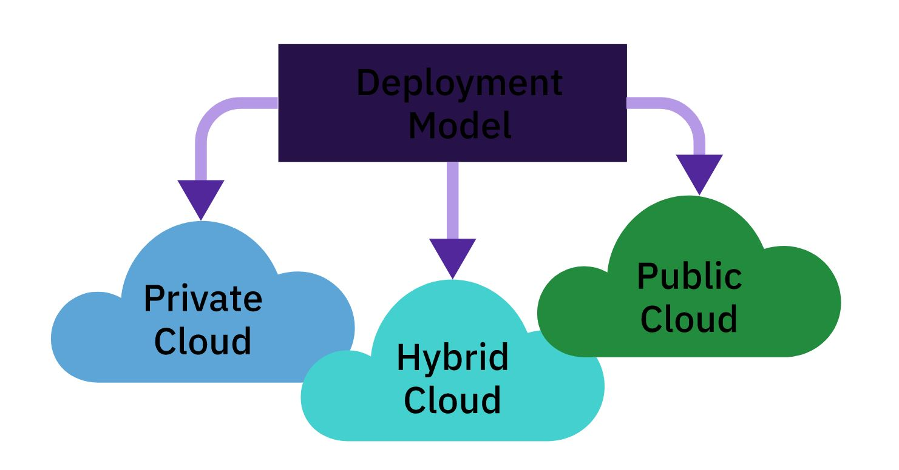
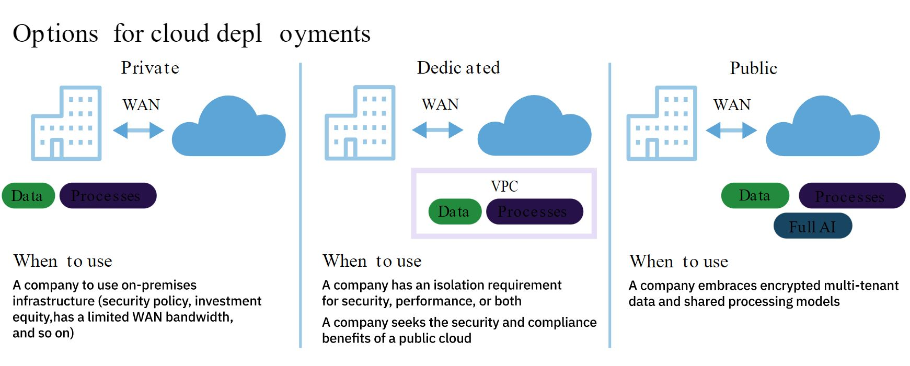
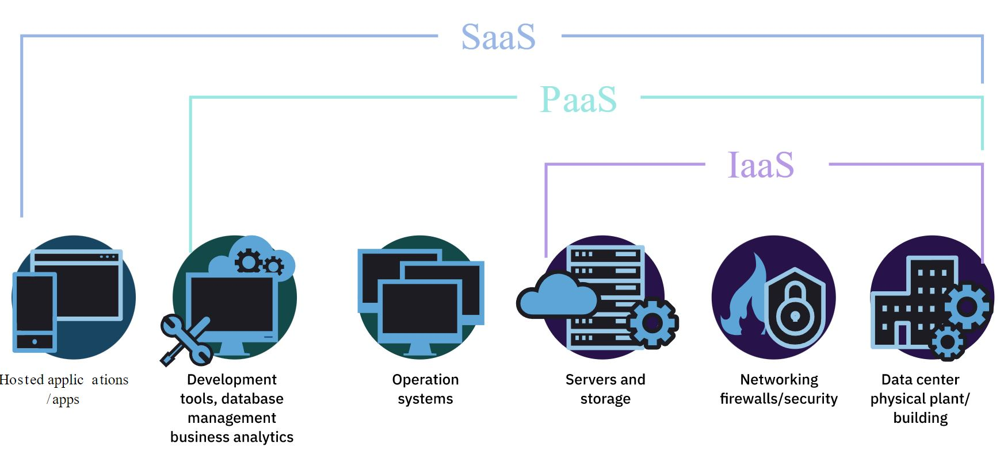

# cloudComputing
 - Sources and material provided by IBM.

## How does cloud computing work?
Cloud computing stores and processes information over the internet instead of relying on a local hard drive to store the data. 
Uploading to a cloud over local storage accomplishes 2 benefits.

  - It can store and process much larger amounts of information faster.
  - It can deliver results to any device that has an internet connection, not restricted to a device or set of local terminals.

### Examples of cloud services:
  - Netflix, Dropbox, Microsoft Office Online, iTunes, etc...

As long as a service doesn’t require you to be physically close to the storage hardware, it can deliver information to you from the cloud. Deposit a check through your phone? Upload a photo for your friends?  You’re in the cloud!

### Cloud services take 3 forms:

### Public clouds share storage and computing space
Public clouds are owned and operated by companies that offer their customers rapid access to affordable computing resources. This is the classic cloud computing model, in which small businesses and individuals like you can access a lot of computing power over the Internet. It’s easy to scale when users need more power or storage. Because many users are working inside one large bank of information but their data must be kept separate and secure, this kind of cloud is organized by what’s called multi-tenant architecture.

### Private clouds protect a single entity’s information
A private cloud is operated for a single organization. It can be hosted and managed either by that organization or by a provider, and its servers can reside either inside or outside the organization itself. Of course, this privacy also means that as a private cloud’s data expands, the organization has to install more and more private servers. Organizations prefer a private cloud if they need tight control over where their data is being held, how it is organized, and how it is protected. Private clouds can be very secure—but they are expensive!

### Hybrid clouds divide their storage into private slices
What if a business needs the low cost and scalability of a public cloud, but also needs a secure environment for product development or confidential data? These organizations wind up spreading their workloads across data centers, private clouds, and public clouds—thereby creating hybrid clouds.

A hybrid cloud mixes public and private resources. It’s a bit of this and a bit of that, with some data in a public cloud, and some in a private cloud, provided by multiple vendors who offer different levels of cloud usage. A hybrid cloud’s combination of physical and virtual servers allows organizations to rent what they need, on demand, helping them control costs while providing some flexibility.

## Cloud "as a service"
### Three service models

Any traditional service can be delivered through cloud. The concept is called anything as a service, or (XaaS).

The three most popular service models of cloud computing:
 - Software as a service (SaaS)
 - Platform as a service (PaaS)
 - Infrastructure as a service (IaaS)

### SaaS
With SaaS, software and data both reside online. Users can log in on a browser from almost any kind of device on almost any operating system, enter what they need, and out pops their result. Since their organization doesn’t need special software to use SaaS, it doesn’t have to buy applications. Instead it pays for yearly or per-user subscriptions to the service.

When you hear SaaS, think of uses like email or online shopping.

### PaaS
With PaaS, a vendor provides only the platform—meaning the infrastructure, operating systems, storage, and much of the code. The user’s organization manages the application’s resources and the data.

When you hear PaaS, think of containers, databases, runtime, and integration.

### IaaS
Companies turn to IaaS when they want to build their own applications from the ground up, or move existing applications from a data center into the organization to cut down on IT costs. With IaaS, a vendor provides the infrastructure and architecture like hardware, software, servers, and storage, and also handles expensive support systems like backup, security, and maintenance. This leaves the organization’s computing architecture on the web so that teams in different locations can work together, while keeping application development inside the company’s own online structure.

When you hear IaaS, think of computing, storage, and networking resources.

### Multicloud
Is the use of more than one public cloud. It lets a company choose different services from different public clouds. For example, the company might mix several public IaaS environments like IBM Cloud, Amazon Web Services, and Microsoft Azure, so they’re not locked into one cloud provider. Multicloud requires careful planning! Organizations considering it must look for a provider whose architecture can scale and integrate with the company’s existing systems.

### Clouds and premises
- Often people talk about private and public cloud and confuse it with premises. For example, they might think that public cloud is off premises (true), while private cloud is always on premises (false).

- Off premises is a solution that runs on hardware in a different location than the end users. That’s because most cloud vendors run their own data centers off premises from the organizations whose data they store. Their customers’ system administrators have the same access to the data as they would on premises.

- On premises is a solution installed and hosted in-house, usually supported by a third party. Often the on-premises private cloud, also known as an “internal cloud,” is hosted inside an organization’s own data center. It can be easier to protect and maintain, but more limited in size and harder to scale up as the organization grows.

- Some cloud vendors offer a hybrid solution. This means they allow companies to mix on premises at the company’s data center with off premises at the vendor’s data center. This can be helpful if a company’s business comes in bursts. The company can depend on its own data center most of the time, but expand onto the vendor’s data center when the load is high.

## Terminology

### Cloud
- In cloud computing, “cloud” is used as a metaphor for the Internet, so the phrase cloud computing means a type of Internet-based computing.

### Cloud Services
- Cloud services are applications, services, or resources made available to users on demand through the Internet such as: 

  -  Infrastructure as a service (IaaS) 
  -  Platform as a service (PaaS) 
  -  Software as a service (SaaS) 
  -  Data storage 

### Cluster
- A computer cluster is a collection of interconnected stand-alone computers or servers that can work together as a single, integrated computing resource. 

### Containers
- A container is a “wrapper” that allows software to travel between operating environments. Containers create a unique virtual instance of an operating system (OS) that separates an application from others in the same environment. Containers can run separate instances of an application within a single, shared OS.

### Hybrid Cloud
- A hybrid cloud is a combination of traditional IT and public or private clouds (or both) that remain separate, but are bound together by technology that makes the data or application portable. 

### Infrastructure as a Service (IaaS)
- IaaS delivers computer infrastructure on an outsourced basis to support a company’s operations. It includes servers, network, operating systems, and storage, through virtualization technology which doesn’t require that the company physically maintain or manage it. Its cloud servers typically include a dashboard or an application programming interface (API) that gives the company control of the entire infrastructure.

- Startups and small companies may prefer IaaS to avoid spending time and money buying and creating hardware and software such as servers, storage, or networking resources.

- When you hear IaaS, think of computing, storage, and networking resources.

### Kubernetes
- Kubernetes is an open-source platform for managing containerized workloads and services.

### Multicloud
- Multicloud is the use of more than one public cloud, a strategy that allows enterprises to choose specific services from a combination of public IaaS clouds such as IBM Cloud, Amazon Web Services, and Microsoft Azure. This enables companies to avoid locking in to any one cloud provider.

### On Premises versus off Premises
- On premises refers to a solution installed and hosted in-house. Private cloud is hosted in a company’s own data center.

- A solution that is hosted on dedicated hardware that happens to be in a different physical location is referred to as off premises.

### Platform as a Service (PaaS)
- PaaS provides cloud components for software programs. PaaS delivers a framework for developers that they can use to create customized applications. The platform typically includes an operating system, a programming language execution environment, a database, and a web server.

- When you hear PaaS, think of development tools, database management, and business analytics. 

### Private Cloud
- A private cloud is an on-premises or off-premises cloud infrastructure operated solely for one organization. It may be managed by that organization or by a third party.

### Public Cloud
- A public cloud is available to the general public or a large industry group, owned and managed by an organization selling cloud services.

### Software as a Service (SaaS)
- SaaS refers to a model of software deployment where online software is provided as a service to customers. 

- When you hear SaaS, think of hosted subscription applications or web email, Google apps, or Dropbox.

### Virtualization
- Virtualization is the creation of a virtual (rather than actual) version of something such as a server, a desktop, a storage device, an operating system, or network resources.

### Virtual Machine
- A virtual machine (VM) is a software program or operating system that behaves like a separate computer that can run applications and programs.

### Workload
- A workload is a discrete capability or amount of work to be run in the cloud, such as serving up a website.

### Cloud Computing Summary

A staggering amount of fresh data is
added to the world every day!

2.5 quintillion bytes

### Programming languages for Cloud
- Python
- Perl
- Ruby
- Puppet
- Chef
- Anisble
- Docker
- VMware
- PHP
- Java
- .NET

### Major Vendors' training/credential programs:
- AWS
- Azure
- Google Cloud
- IBM CLoud
- Red Hat

### Getting started
- Internship
- Training
- College Degree
- Learning Programming Languages
- Certificate Programs

### Cloud Computing Roles
- Cloud Architect
- Cloud Administrator
- Cloud Engineer
- Cloud Application Developer
- Cloud Security Manager
- Cloud Network Engineer
- Cloud Automation Engineer

